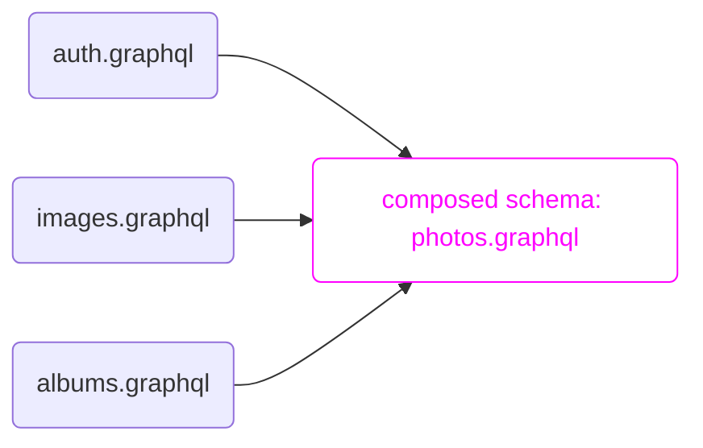

# Join

<h2>for defining *supergraphs* which join multiple *subgraphs*</h2> 

```raw html
<table class=spec-data>
  <tr><td>Status</td><td>Draft</td>
  <tr><td>Version</td><td>0.1</td>
</table>
<link rel=stylesheet href=/apollo-dark.css>
<link rel=stylesheet href=/tron.css>
<script type=module async defer src=/install-nav.js></script>
```



This document defines a [core feature](https://specs.apollo.dev/core/v0.1) named `join` for describing [core schemas](https://specs.apollo.dev/core/v0.1) which **join** multiple **subgraph** schemas into a single **supergraph** schema.

This specification provides machinery to:
- define [subgraphs](#def-subgraph) with the {join__Graph} enum and the {@join__graph} directive
- assign fields to subgraphs with {@join__field}
- declare additional data required and provided by subgraph field resolvers with the [`requires`](#@join__field/requires) and [`provides`](#@join__field/provides) arguments
- assign keys and ownership to types with {@join__type} and {@join__owner}

# How to read this document

This document uses [RFC 2119](https://www.ietf.org/rfc/rfc2119.txt) guidance regarding normative terms: MUST / MUST NOT / REQUIRED / SHALL / SHALL NOT / SHOULD / SHOULD NOT / RECOMMENDED / MAY / OPTIONAL.

## What this document isn't

This document specifies only the structure and semantics of supergraphs. It's expected that a supergraph will generally be the output of a compilation process which composes subgraph schemas. The mechanics of that process are not specified normatively here. Conforming implementations may choose any approach they like, so long as the result conforms to the requirements of this document.

# Example: Photo Library

*This section is non-normative.*

We'll refer to this example of a photo library throughout the document:

:::[example](./photos.graphql) -- Photos library composed schema

The meaning of the `@join__*` directives is explored in the [Directives](#sec-Directives) section.

The example represents **one way** to compose three input schemas, based on [federated composition](https://www.apollographql.com/docs/federation/federation-spec/). These schemas are provided for purposes of illustration only. This spec places no normative requirements on composer input. It does not require that subgraphs use federated composition directives, and it does not place any requirements on *how* the composer builds a supergraph, except to say that the resulting schema must be a valid supergraph document.

[auth](./auth.graphql) provides the `User` type and `Query.me`.

:::[example](auth.graphql) -- Auth schema

[images](./images.graphql) provides the `Image` type and `URL` scalar.

:::[example](./images.graphql) -- Images schema

[albums](./albums.graphql) provides the `Album` type and extends `User` and `Image` with album information.

:::[example](./albums.graphql) -- Albums schema


# Actors

```mermaid diagram -- Actors and roles within an example composition pipeline
flowchart TB
    subgraph A [subgraph A]
      schemaA([schema A])
      endpointA([endpoint A])
    end    
    subgraph B [subgraph B]
      schemaB([schema B])
      endpointB([endpoint B])
    end
    subgraph C [subgraph C]
      schemaC([schema C])
      endpointC([endpoint C])
    end
    subgraph "Producer ⠀⠀⠀⠀⠀⠀⠀⠀⠀⠀⠀⠀⠀⠀⠀⠀⠀⠀⠀⠀⠀⠀⠀⠀⠀⠀⠀⠀⠀⠀⠀⠀⠀⠀"
      Composer
    end
    supergraph([Supergraph])
    subgraph "Consumer ⠀⠀⠀⠀⠀⠀⠀⠀⠀⠀⠀"
      Router
    end    
    A-->Composer
    B-->Composer
    C-->Composer
    Composer-->joinSchema
    joinSchema-->Router
    Router-->published([Published Schema])
    published-->Clients
    Clients-->Router
```

<a name=def-producer>**Producers**</a> generate supergraphs. This spec places requirements on supergraph producers.

<a name=def-consumer>**Consumers**</a> consume supergraphs. This spec places requirements on supergraph consumers.

<a name=def-composer>**Composers** (or **compilers**)</a> are producers which compose subgraphs into a supergraph. This document places no particular requirements on the composition algorithm, except that it must produce a valid supergraph.

<a namme=def-router>**Routers**</a> are consumers which serve a composed schema as a GraphQL endpoint. *This definition is non-normative.*
  - Graph routers differ from standard GraphQL endpoints in that they are not expected to resolve fields or communicate with (non-GraphQL) backend services on their own. Instead, graph routers receive GraphQL requests and service them by performing additional GraphQL requests. This spec provides guidance for implementing routers, but does not require particular implementations of query separation or dispatch, nor does it attempt to normatively separate routers from other supergraph consumers.
  - Routers will often omit schema elements from the API schema that is used to validate client operations and that they present to clients via introspection ({join__Graph}, for example, will typically be omitted)

<a name=def-endpoint>**Endpoints**</a> are running servers which can resolve GraphQL queries against a schema. In this version of the spec, endpoints must be URLs, typically http/https URLs.

<a name=def-subgraph>**Subgraphs**</a> are GraphQL schemas which are composed to form a supergraph. Subgraph names and metadata are declared within the special {join__Graph} enum.

This spec does not place any requirements on subgraph schemas. Generally, they may be of any shape. In particular, subgraph schemas do not need to be supergraphs themselves or to follow this spec in any way; neither is it an error for them to do so. Composers MAY place additional requirements on subgraph schemas to aid in composition; composers SHOULD document any such requirements.

# Data Model

TODO maybe this should be called something more like "Overview" or "Graph Routing in a Supergraph" or something?

*This section is non-normative.* It describes the motivation behind the directives defined by this specification.

A supergraph schema describes a GraphQL schema that can be served by a router. The router does not contain logic to resolve any of the schema's fields; instead, the supergraph schema contain directives starting with {@join__} which tell the router which subgraph endpoints can resolve each field, as well as other information needed in order to construct subgraph queries.  The directives described in this specification are designed for a particular query planning algorithm, and so there are some restrictions on how they can be combined that originate from the requirements of this algorithm. (We hope that future versions of this specification can relax some of these restrictions.)

Each supergraph schema contains a list of the subgraphs. It represents this as an enum called [{join__Graph}](#join__Graph) with an enum value for each subgraph. Each enum value is annotated with a [{@join__graph}](#@join__graph) directive telling the router what endpoint can be used to reach the subgraph and a name for the subgraph that can be used in representations of query plans and diagnostic messages.

To resolve a field, the router needs to know to which subgraphs it can delegate the field's resolution. The most direct way to indicate this in a supergraph schema is by annotating the field with a [{@join__field}](#@join__field) directive specifying which subgraph should be used to resolve that field.

In order for the router to send an operation that resolves a given field on a parent object to a subgraph, the operation needs to first resolve the parent object itself. There are several ways to accomplish this, described below. The examples below include abbreviated versions of the supergraph schemas which do not include the `schema` definition, directive definitions, or the `join__Graph` definition. This specification does not require the subgraph queries to be the same as those described in these examples; this is just intended to broadly describe the meanings of the directives.

## Root fields

If this field appears at the root of the overall operation (query or mutation), then the field can just be placed at the root of the subgraph operation.

```graphql example -- Root fields
# Supergraph schema
type Query {
  fieldA: String @join__field(graph: A)
  fieldB: String @join__field(graph: B)
}

# Operation
{ fieldA fieldB }
# Generated subgraph operations
## On A:
{ fieldA }
## On B:
{ fieldB }
```


## Fields on the same subgraph as the parent operation

If this field's parent field will be resolved by an operation on the same subgraph, then this field can be resolved as part of the same operation, by putting it in a nested selection set on the parent field's subgraph operation. Note that this example contains a {@join__owner} directive on an object type; this will be described later.

```graphql example -- Fields on the same subgraph as the parent operation
# Supergraph schema
type Query {
  fieldA: X @join__field(graph: A)
}

type X @join__owner(graph: A) {
  nestedFieldA: String @join__field(graph: A)
}

# Operation
{ fieldA { nestedFieldA } }
# Generated subgraph operations
## On A:
{ fieldA { nestedFieldA }}
```

## Fields provided by the parent field

When resolving a field to a composite type (object, interface, or union), it is sometimes easy to calculate the values of nested fields inside that object even if those nested fields are ordinarily resolved in a different subgraph. When this is the case, you can include a `provides` argument in the `@join__field` listing these "pre-calculated" fields. The router can now resolve these fields in the "providing" subgraph instead of in the subgraph that would usually be used to resolve those fields.

```graphql example -- Provided fields
# Supergraph schema
type Query {
  fieldA: X @join__field(graph: A, provides: "usuallyBField")
  fieldB: X @join__field(graph: B)
}

type X @join__owner(graph: B) {
  usuallyBField: String @join__field(graph: B)
}

# Operation
{ fieldB { usuallyBField } }
# Generated subgraph operations
## On B
{ fieldB { usuallyBField } }

# Operation
{ fieldA { usuallyBField } }
# Generated subgraph operations
## On A
{ fieldA { usuallyBField } }
```

## Fields on value types

Some types have the property that all of their fields can be resolved by *any* subgraph that can resolve a field returning that type. These types are called *value types*. (Imagine a type `type T { x: Int, y: String }` where every resolver for a field of type `T` actually produces an object like `{x: 1, y: "z"}`, and the resolvers for the two fields on `T` just unpack the values already in the object.) In a supergraph schema, a type is a value type if it does not have a [{@join__owner}](#@join__owner) directive on it.

```graphql example -- Value types
# Supergraph schema
type Query {
  fieldA: X @join__field(graph: A)
  fieldB: X @join__field(graph: B)
}

type X {
  anywhere: String
}

# Operation
{ fieldA { anywhere } }
# Generated subgraph operations
## On A
{ fieldA { anywhere } }

# Operation
{ fieldB { anywhere } }
# Generated subgraph operations
## On B
{ fieldB { anywhere } }
```

## Owned fields on owned types

We've finally reached the most interesting case: a field that must be resolved by an operation on a different subgraph from the subgraph on which its parent field was resolved. In order to do this, we need a way to tell the subgraph to resolve that parent object. We do this by defining a special root field in the subgraph's schema: `Query._entities(representations: [_Any!]!): [_Entity]!`. This field takes a list of "representations", which are JSON objects containing a `__typename` field and some other fields, and returns a list of the same length of the corresponding objects resulting from looking up the representations in an application-dependent way.

There are several ways that the router can calculate a representation to pass to a subgraph. In this specification, all non-value types have a specific subgraph referred to as its "owner", specified via a `@join__owner` directive on the type. (Object types that are not value types are referred to as "entities"; the type `_Entity` referenced above is a union defined in each subgraph's schema consisting of the entity types defined by that subgraph. Only subgraphs which define entities need to define the `Query._entities` field.) The type must also have at least one `@join__type` directive specifying the owning subgraph along with a {key}. For each additional subgraph which can resolve fields returning that type, there should be exactly one `@join__type` directive specifying that subgraph along with a {key}, which should be identical to one of the keys specified with the owning subgraph.

A key is a set of fields on the type (potentially including sub-selections and inline fragments), specified as a string. If a type `T` is annotated with `@join__type(subgraph: G, key: "a b { c }")`, then it must be possible to resolve the full field set provided as a key on subgraph G. Additionally, if you take an object with the structure returned by resolving that field set and add a field `__typename: "T"`, then you should be able to pass the resulting value as a representation to the `Query._entities` field on subgraph G.

In order to resolve a field on an entity on the subgraph that owns its parent type, where that subgraph is different from the subgraph that resolved its parent object, the router first resolves a key for that object on the previous subgraph, and then uses that representation on the owning subgraph.

For convenience, you may omit `@join__field(graph: A)` directives on fields whose parent type is owned by `A`.

```graphql example -- Owned fields on owned types
# Supergraph schema
type Query {
  fieldB: X @join__field(graph: B)
}

type X
    @join__owner(graph: A)
    # As the owner, A is allowed to have more than one key.
    @join__type(graph: A, key: "x")
    @join__type(graph: A, key: "y z")
    # As non-owners, B and C can only have one key each and
    # they must match a key from A.
    @join__type(graph: B, key: "x")
    @join__type(graph: C, key: "y z")
  {
  # Because B owns X, we can omit @join__field(graph: B)
  # from these two fields.
  x: String
  y: String
  z: String
}

# Operation
{ fieldB { y } }
# Generated subgraph operations
## On B. `y` is not available, so we need to fetch B's key for X.
{ fieldB { x } }
## On A
## $r = [{__typename: "X", x: "some-x-value"}]
query ($r: [_Any!]!) { _entities(representations: $r]) { y } }
```

## Extension fields on owned types

The previous section described how to jump from one subgraph to another in order to resolve a field on the subgraph that owns the field's parent type. The situation is a bit more complicated when you want to resolve a field on a subgraph that doesn't own the field's parent type — what we call an extension field. That's because we no longer have the guarantee that the subgraph you're coming from and the subgraph you're going to share a key in common. In this case, we may need to pass through the owning type.

```graphql example -- Extension fields on owned types
# Supergraph schema
type Query {
  fieldB: X @join__field(graph: B)
}

type X
    @join__owner(graph: A)
    # As the owner, A is allowed to have more than one key.
    @join__type(graph: A, key: "x")
    @join__type(graph: A, key: "y z")
    # As non-owners, B and C can only have one key each and
    # they must match a key from A.
    @join__type(graph: B, key: "x")
    @join__type(graph: C, key: "y z")
  {
  x: String
  y: String
  z: String
  c: String @join__field(graph: C)
}

# Operation
{ fieldB { c } }
# Generated subgraph operations
## On B. `c` is not available on B, so we need to eventually get over to C.
## In order to do that, we need `y` and `z`... which aren't available on B
## either! So we need to take two steps. First we use B's key.
{ fieldB { x } }
## On A. We use B's key to resolve our `X`, and we extract C's key.
## $r = [{__typename: "X", x: "some-x-value"}]
query ($r: [_Any!]!) { _entities(representations: $r]) { y z } }
## On C. We can finally look up the field we need.
## $r = [{__typename: "X", y: "some-y-value", z: "some-z-value"}]
query ($r: [_Any!]!) { _entities(representations: $r]) { c } }
```

We only need to do this two-jump process because the fields needed for C's key are not available in B; otherwise a single jump would have worked, like in the owned-field case.

Sometimes a particular extension field needs its parent object's representation to contain more information than its parent type's key requests. In this case, you can include a `requires` argument in the field's `@join__field` listing those required fields (potentially including sub-selections). **All required fields must be resolvable in the owning subgraph** (this restriction is why `requires` is only allowed on extension fields).

```graphql example -- Required fields
# Supergraph schema
type Query {
  fieldA: X @join__field(graph: A)
}

type X
    @join__owner(graph: A)
    @join__type(graph: A, key: "x")
    @join__type(graph: B, key: "x")
  {
  x: String
  y: String
  z: String @join__field(graph: B, requires: "y")
}

# Operation
{ fieldA { z } }
# Generated subgraph operations
## On A. `x` is included because it is B's key for `X`; `y`
## is included because of the `requires`.
{ fieldA { x y } }
## On B..
## $r = [{__typename: "X", x: "some-x-value", y: "some-y-value"}]
query ($r: [_Any!]!) { _entities(representations: $r]) { z } }
```

# Basic Requirements

Schemas using the `join` core feature MUST be valid [core schema documents](https://specs.apollo.dev/core/v0.1) with {@core} directives referencing the `core` specification and this specification.

:::[example](photos.graphql#schema) -- {@core} directives for supergraphs

As described in the [core schema specification](https://specs.apollo.dev/core/v0.1/#sec-Prefixing), your schema may use a prefix other than `join` for all of the directive and enum names defined by this specification by including an `as` argument to the `@core` directive which references this specification. All references to directive and enum names in this specification MUST be interpreted as referring to names with the appropriate prefix chosen within your schema.

In order to use the directives described by this specification, GraphQL requires you to include their definitions in your schema.

Processors MUST validate that you have defined the directives with the same arguments, locations, and `repeatable` flag as given below.

:::[definition](join.spec.graphql)

As described in the core specification, all of the directives and enums defined by this schema should be removed from the supergraph's API schema. For example, the {join__Graph} enum should not be visible via introspection.

# Enums

##! join__Graph

Enumerate subgraphs.

```graphql definition
enum join__Graph
```

Documents MUST define a {join__Graph} enum. Each enum value describes a subgraph. Each enum value MUST have a [{@join__graph}](#@join__graph) directive applied to it.

:::[example](photos.graphql#join__Graph) -- Using join__Graph to define endpoints

The {join__Graph} enum is used as input to the [{@join__owner}](#@join__owner), [{@join__field}](#@join__field), and [{@join__type}](#@join__type) directives.

# Directives

##! @join__graph

Declare subgraph metadata on {join__Graph} enum values. 

```graphql definition
directive @join__graph(name: String!, url: String!) on ENUM_VALUE
```

:::[example](photos.graphql#join__Graph) -- Using {@join__graph} to declare subgraph metadata on the {join__Graph} enum values.

##! @join__type

Join a type to a subgraph, optionally providing an entity key.

```graphql definition
directive @join__type(
  graph: join__Graph!
  key: String
) repeatable on OBJECT | INTERFACE
```

// TODO: rename portal query?
Keys will be passed as `representations` within a [portal query](#portal-query) to [port](#portability) a selection set between subgraphs.

:::[example](photos.graphql#Image) -- Using {@join__type} to specify subgraph keys

Multiple {@join__type}s can be specified for different subgraphs. It is an error to {@join__type} an object against the same subgraph multiple times.

##! @join__owner

Specify the graph which owns the object type.

```graphql definition
directive @join__owner(graph: join__Graph!) on OBJECT
```

Object types with keys MUST be owned by a subgraph. The owning subgraph:
  - MUST be able to resolve all of the object's keys for any subgraph 
  - MUST be able to resolve all fields referenced via [requires](@join__field/requires)

Note: Type ownership is currently slated for removal in a future version of this spec. It is RECOMMENDED that router implementations consider approaches which function in the absence of these restrictions.

##! @join__field

Join a field with a particular subgraph.

```graphql definition
directive @join__field(
  graph: join__Graph
  requires: String!
  provides: String!
) on FIELD_DEFINITION
```

The parent type MUST be {@join__type}ed with the specified `graph:`, unless it is a root type.

Any field definitions without a {@join__field} directive are assumed to be resolvable in any subgraph which {@join__type}s the parent type.

:::[example](photos.graphql#User...Image) -- Using {@join__field} to join fields to subgraphs

Fields on root types must always be bound to a subgraph:

:::[example](photos.graphql#Query) -- {@join__field} on root fields

```html diagram
<script>line => line.includes("me: User") || line.includes("images: [Image]")</script>
```

