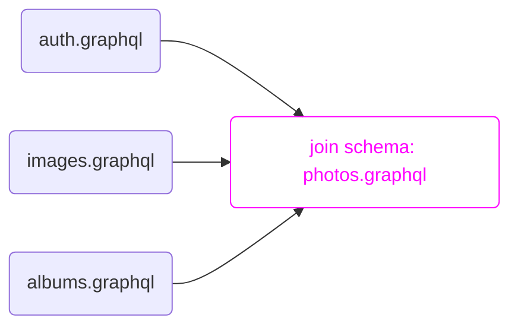

# Join

<h2>for defining *supergraphs* which join multiple *subgraphs*</h2> 

```raw html
<table class=spec-data>
  <tr><td>Status</td><td>Draft</td>
  <tr><td>Version</td><td>0.1</td>
</table>
<link rel=stylesheet href=/apollo-dark.css>
<link rel=stylesheet href=/tron.css>
<script type=module async defer src=/install-nav.js></script>
```



This document defines schema elements for describing [core schemas](/core/v0.1) which **join** multiple **subgraph** schemas into a single **supergraph** schema.

This specification provides machinery to:
- define [subgraphs](#def-subgraph) with the {join__Graph} enum
- assign fields to subgraphs with {@join__field}
- declare additional data required and provided by subgraph field resolvers with [`requires:`](#@join__field/requires) and [`provides:`](#@join__field/provides)

# How to read this document

This document uses [RFC 2119](https://www.ietf.org/rfc/rfc2119.txt) guidance regarding normative terms: MUST / MUST NOT / REQUIRED / SHALL / SHALL NOT / SHOULD / SHOULD NOT / RECOMMENDED / MAY / OPTIONAL

## What this document isn't

This document specifies only the structure and semantics of join schemas. It's expected that the join schemas will generally be the output of a compilation process which composes subgraph schemas. The mechanics of that process are not specified normatively here; a suggestion is provided in [Appendix: Basic Composition Algorithm](#sec-Appendix-Suggested-Composition-Algorithm). Conforming implementations may choose any approach they like, so long as the result conforms to the requirements of this document.

# Example: Photo Library

*This section is non-normative.*

We'll refer to this example of a photo library throughout the document:

:::[example](./photos.graphql) -- Photos library composed schema

The meaning of the `@join__*` directives is explored in the [Directives](#sec-Directives) section.

The example represents **one way** to compose three input schemas, based on [federated composition](https://www.apollographql.com/docs/federation/federation-spec/). These schemas are provided for purposes of illustration only. This spec places no normative requirements on composer input. It does not require that subgraphs use federated composition directives, and it does not place any requirements on *how* the composer builds a join schema, except to say that the resulting schema must be a valid join schema document.

[auth](./albums.graphql) provides the `User` type and `Query.me`.

:::[example](auth.graphql) -- Auth schema

[images](./images.graphql) provides the `Image` type and `URL` scalar.

:::[example](./images.graphql) -- Images schema

[albums](./albums.graphql) provides the `Album` type and extends `User` and `Image` with album information.

:::[example](./albums.graphql) -- Albums schema


# Actors

```mermaid diagram -- Actors and roles within an example composition pipeline
flowchart TB
    subgraph A [subgraph A]
      schemaA([schema A])
      endpointA([endpoint A])
    end    
    subgraph B [subgraph B]
      schemaB([schema B])
      endpointB([endpoint B])
    end
    subgraph C [subgraph C]
      schemaC([schema C])
      endpointC([endpoint C])
    end
    subgraph "Producer ⠀⠀⠀⠀⠀⠀⠀⠀⠀⠀⠀⠀⠀⠀⠀⠀⠀⠀⠀⠀⠀⠀⠀⠀⠀⠀⠀⠀⠀⠀⠀⠀⠀⠀"
      Composer
    end
    joinSchema([Join Schema])
    subgraph "Consumer ⠀⠀⠀⠀⠀⠀⠀⠀⠀⠀⠀"
      Router
    end    
    A-->Composer
    B-->Composer
    C-->Composer
    Composer-->joinSchema
    joinSchema-->Router
    Router-->published([Published Schema])
    published-->Clients
    Clients-->Router
```

<a name=def-producer>**Producers**</a> generate join schemas. This spec places requirements on join schema producers.

<a name=def-consumer>**Consumers**</a> consume join schemas. This spec places requirements on join schema consumers.

<a name=def-composer>**Composers** (or **compilers**)</a> are producers which compose subgraph schemas into a join schema. This document places no particular requirements on the composition algorithm, except that it must produce valid join schemas.

<a namme=def-router>**Routers**</a> are consumers which serve a composed schema as a GraphQL endpoint. *This definition is non-normative.*
  - Graph routers differ from standard GraphQL endpoints in that they are not expected to process data or communicate with (non-GraphQL) backend services on their own. Instead, graph routers receive GraphQL requests and service them by performing additional GraphQL requests. This spec provides guidance for implementing routers, but does not require particular implementations of query separation or dispatch, nor does it attempt to normatively separate routers from other join schema consumers.
  - Routers will often join schema elements from the schema they present to clients via introspection ({join__Graph}, for example, will typically be omitted)

<a name=def-endpoint>**Endpoints**</a> are running servers which can resolve GraphQL queries against a schema. In this version of the spec, endpoints must be URLs, typically http/https URLs.

<a name=def-subgraph>**Subgraphs**</a> are the GraphQL schemas which were composed to form the join schema. They are declared as values on the special {join__Graph} enum.

This spec does not place any requirements on subgraph schemas. Generally, they may be of any shape. In particular, subgraph schemas do not need to be join schemas or to follow this spec in any way; neither is it an error for them to do so. Composers MAY place additional requirements on subgraph schemas to aid in composition; composers SHOULD document any such requirements.

# Basic Requirements

Schemas using {@join} MUST be valid [core schema documents](/core/v0.1) with {@core} directives referencing this specification along with any transitively referenced specifications.

:::[example](photos.graphql#schema) -- {@core} directives for join schemas

# Enums

##! join__Graph

Enumerate subgraphs.

```graphql definition
enum join__Graph
```

Documents MUST define a {join__Graph} enum. Each enum value defines a subgraph.

:::[example](photos.graphql#join__Graph) -- Using join__Graph to define endpoints

The {join__Graph} enum is used as input to {@join} directives which link fields and types to subgraphs.

# Scalars

Documents MUST include definitions of any scalars they use. Producers SHOULD include the `@specifiedBy` directive, but it is not mandatory.

##! join__Never

:::[definition](photos.graphql#join__Never)

The {join__Never} scalar is used to indicate the type of a field which **cannot be resolved**. This is typically due to a composition error. Producers SHOULD provide more specific error information with an {@error} directive on the relevant field.

:::[example](photos.graphql#User.favorite) -- Using {join__Never} and {@error} to mark a field error

# Directives

##! @join__type

Join a type to a subgraph, optionally providing an entity key.

```graphql definition
directive @join__type(
  graph: join__Graph!,
  key: ref__Fragment)
  repeatable on OBJECT
```

Keys will be passed as `representations` within a [portal query](#portal-query) to [port](#portability) a selection set between subgraphs.

:::[example](photos.graphql#Image) -- Using {@join__type} to specify subgraph keys

```html diagram
<script>line => elStr(line).includes("key:")</script>
```

Multiple {@join}s can be specified for different subgraphs. It is an error to {@join} an object against the same subgraph multiple times.

##! @join__owner

Specify the graph which owns the object type.

```graphql definition
directive @join__owner(graph: join__Graph!)
  on OBJECT
```

Object types with keys MUST be owned by a subgraph. The owning subgraph:
  - MUST be able to resolve all of the object's keys for any subgraph 
  - MUST be able to resolve all fields referenced via [requires](@join__field/requires)

Note: Type ownership is currently slated for removal in a future version of this spec. It is RECOMMENDED that router implementations consider approaches which function in the absence of these restrictions.

##! @join__field

Join a field with a particular subgraph.

```graphql definition
directive @join__field(
  graph: join__Graph!,
  requires: ref__Fragment!,
  provides: ref__Fragment!
) on FIELD_DEFINITION
```

The parent type MUST be {@join}ed with the specified `graph:`.

Any field definitions without a {@join} directive are assumed to be resolvable in any subgraph which {@join}s the parent type.

:::[example](photos.graphql#User...Image) -- Using {@join__field} to join fields to subgraphs

```html diagram
<script>line => line.includes("@join") && !line.includes("type ") && !line.includes("key:")</script>
```

Fields on root types must always be bound to a subgraph:

:::[example](photos.graphql#Query) -- {@join} on root fields

```html diagram
<script>line => line.includes("me: User") || line.includes("images: [Image]")</script>
```


# Data Model

```mermaid diagram -- The router separates an incoming query into one or more subgraph queries
graph LR
  incoming(Incoming Query)-->router(Router)
  router-->o1(Outbound Query 1)-->s1(subgraph A)
  router-->o2(Outbound Query 2)-->s2(subgraph B)
  router-->o3(Outbound Query 3)-->s3(subgraph C)
```

## Selection set realization

The role of the router is to break apart an incoming query against the published schema into outbound queries against subgraph schemas.

A *realized selection set* is a selection within an inbound query, with particular type bounds, which will be issued against a particular subgraph. We denote the realized type of this selection set as `subgraph::(Type Bounds)`. Within this section, we use the special subgraph name `self` to refer to the exported composed schema.

Within a realized selection set, the router can only query fields known to the realized subgraph and valid within the type bounds. As usual with GraphQL execution, a selection on more specific bounds can be acquired by emitting an inline fragment (`...on Subtype`). Porting to a different subgraph—to acquire bounds specific to that subgraph, including fields bound to that subgraph—requires a [portal query](#portal-query).

```graphql example -- Query with resolvers and realized selection sets
               # resolver              | realizes
               # ---------------------------------------               
query {        # (root)                -> self::Query
    albums {   # albums::Query.albums  -> albums::Album
      user {   # albums::Album.user    -> albums::User
        name   # auth::User.name       -> String
      }
    }
  }
}
```

This query requires one portal: `name` is available on `self::User` but not on `albums::User`. Instead, it is provided only by `auth::User`. Since `name` is selected within an `albums::User`, the router must use a [portal](#portal-query) to acquire a selection on `auth::User` and resolve the field.

### Free / Bound fields

Free fields can be resolved by any subgraph which can realize a selection on the parent type. Bound fields can only be resolved by the subgraph they're bound to, which may require [porting](#portability) the selection set between graphs.

### Portability

A type is *portable to* a subgraph if it has a key defined for that subgraph.

```graphql example -- A query crossing subgraph boundaries
query {
  me {
    albums {
      user {
        name
      }
    }
  }
}
```

Incoming queries cross subgraph boundaries require "porting" wherever they select a field that is not resolvable by the subgraph of the realized type from which they are selected. In the above example, selecting `me.albums.user.name` crosses such a boundary, since `albums.user` is a selection on `albums::User` and `user.name` is only resolvable by `auth::User.name`.

To resolve this query, `albums::User` must be *portable* to `auth::User`. That is, given a selection on `albums::User`, there must be some way to arrive at a selection on `auth::User`.

If fields have multiple bound resolvers, routers SHOULD select the resolver which does not require crossing subgraph boundaries, if possible.

If crossing subgraph boundaries is unavoidable, routers *must* use a [portal query](#portal-query) to re-enter the type in the destination subgraph.

### Portal query

In order to acquire a selection set on a entity within a subgraph, routers may issue a portal query to the subgraph:

```graphql example -- Portal query
query {
  _entities(representations: $representations) {
    # ...selections...
  }
}
```

`representations` MUST be a list of input objects, each of which consist of the `__typename` of the object type or interface along with the result of fetching one that subgraph's `key` fragment for the type.

```graphql example -- Portal query with representations
query {
  _entities(representations: [
    { __typename: "Image", url: "http://example.com/1.png"},
    { __typename: "Image", url: "http://example.com/2.png"},
  ]) {
    # ...selection on Image...
  }
}
```

The `_entities` resolver need not be explicitly defined in the subgraph schema. If it is defined, its specified types are ignored—it is assumed that the resolver is capable of resolving objects and interfaces from any key specified within the join schema.

# Validations

## All Fields Resolve

TK This may not be necessary after we re-introduce type ownership

# Appendix: Suggested Composition Algorithm

TK This section may be unnecessary?
